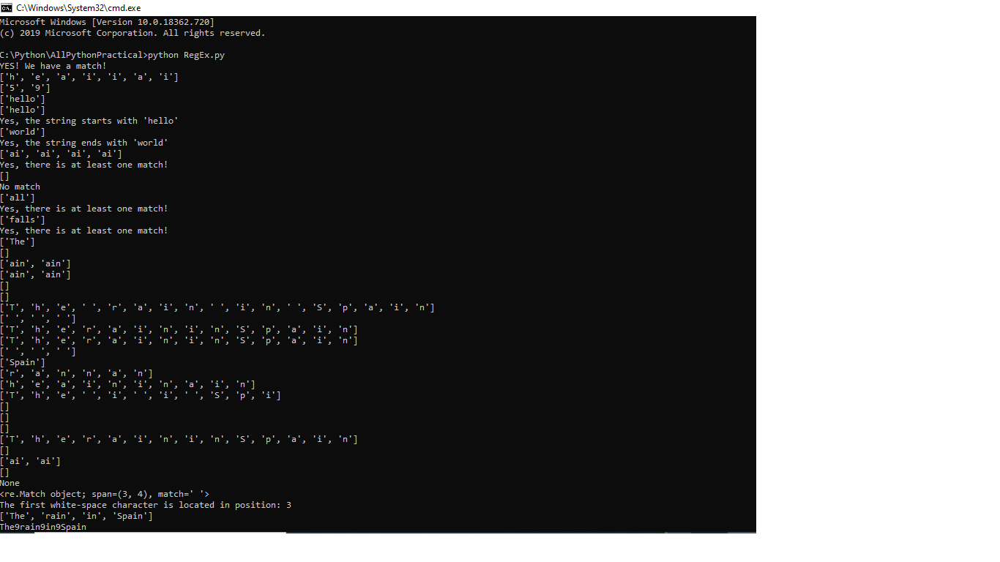

# Python-RegEx

It's an important topic and eagerly used while coding, in order to get appropriate result
In this practical, all basic and all functions are in executable manner because i believe one should self try to execute and understand.

1.Windows command prompt
command to run:
>python RegEx.py

2.Also you can use sublime 3 editor: Ctrl + B to run 

